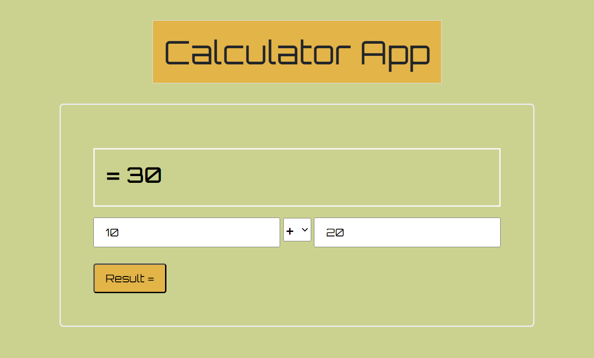

# CalcMate

CalcMate is a simple calculator application built using HTML, CSS, and JavaScript. It allows users to perform basic mathematical operations such as addition, subtraction, multiplication, and division.

## Getting Started

To use CalcMate, simply open the `index.html` file in your web browser. The calculator interface will appear, and you can begin performing calculations by clicking on the buttons.

## Features

- Addition, subtraction, multiplication, and division
- Error Handling for Wrong Input

## Contributing

If you find any bugs or have suggestions for improvements, feel free to submit an issue or a pull request.

## License

This project is licensed under the MIT License - see the [LICENSE.md](LICENSE.md) file for details.
